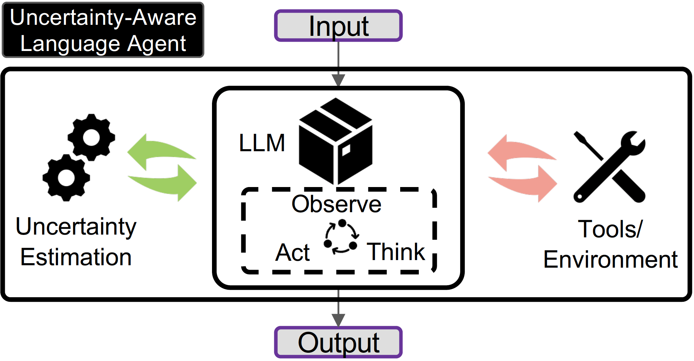
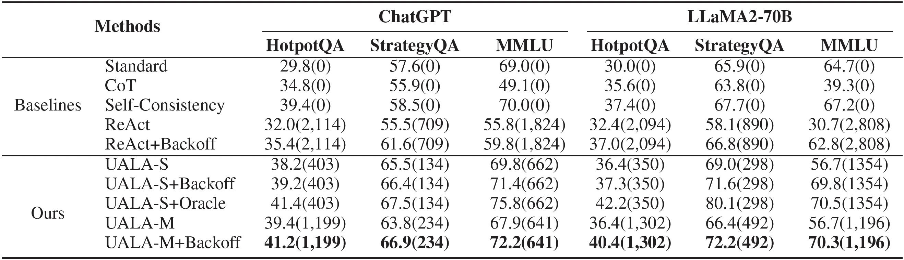

# Towards Uncertainty Aware Language Agent
This is the official repo for the ACL 2024 paper: [Towards Uncertainty-Aware Language Agent](https://aclanthology.org/2024.findings-acl.398.pdf).
<p>
    <a href="https://github.com/Jiuzhouh/Uncertainty-Aware-Language-Agent/tree/main/data">
        
    </a>
    <a href="https://github.com/Jiuzhouh/Uncertainty-Aware-Language-Agent/blob/main/LICENSE">
        
    </a>
</p>

## 💡 Introduction

<p align="center">
    
</p>

<!-- set larger font size for the following text-->
<p>
Language Agents utilising Large Language Models to interact with the external world (e.g., through tools) to process collected observations towards solving a task have achieved great improvements in challenging reasoning tasks. A more effective design for language agents should have a better interplay between the implicit knowledge encoded in LLM's weight and the explicit knowledge of the external world. To this end, we present Uncertainty-Aware Language Agent that integrates uncertainty in language agent's cycle of Thought, Action, and Observation. The uncertainty moderates the interaction between the LLM and the external world, facilitating a more effective and efficient dynamic.
</p>


## 💬 Examples

<p align="center">
    
</p>

## 🛠️ Setup
Configure Environment:
```
pip install -r requirements.txt
```
Configure OpenAI API (for GPT3.5):
```
export OPENAI_API_KEY=<YOUR_KEY>
```
Configure Google Search API (for MMLU):
```
export SERPAPI_API_KEY=<YOUR_KEY>
```

## 🚀 Quick Start

### Free-from Question Answering (HotpotQA)

- GPT3.5: `python run_hotpotqa_gpt3.5.py`
- LLaMA2-70B: `python run_hotpotqa_llama2.py`

### Binary Question Answering (StrategyQA)

- GPT3.5: `python run_strategyqa_gpt3.5.py`
- LLaMA2-70B: `python run_strategyqa_llama2.py`

### Multiple Choice Question Answering (MMLU)

- GPT3.5: `python run_mmlu_gpt3.5.py`
- LLaMA2-70B: `python run_mmlu_llama2.py`

For different settings (standard, cot, react, uala), change the `mode` variable in script.
The uala setting here is UALA-S+Backoff, to use Oracle, set the `oracle` variable in script as `True`.

## 🎯 Results

<p align="center">
    
</p>


## Citation
```
@inproceedings{han-etal-2024-towards,
    title = "Towards Uncertainty-Aware Language Agent",
    author = "Han, Jiuzhou  and
      Buntine, Wray  and
      Shareghi, Ehsan",
    editor = "Ku, Lun-Wei  and
      Martins, Andre  and
      Srikumar, Vivek",
    booktitle = "Findings of the Association for Computational Linguistics ACL 2024",
    month = aug,
    year = "2024",
    address = "Bangkok, Thailand and virtual meeting",
    publisher = "Association for Computational Linguistics",
    url = "https://aclanthology.org/2024.findings-acl.398",
    pages = "6662--6685",
    abstract = "While Language Agents have achieved promising success by placing Large Language Models at the core of a more versatile design that dynamically interacts with the external world, the existing approaches neglect the notion of uncertainty during these interactions. We present the Uncertainty-Aware Language Agent (UALA), a framework that orchestrates the interaction between the agent and the external world using uncertainty quantification. Compared with other well-known counterparts like ReAct, our extensive experiments across 3 representative tasks (HotpotQA, StrategyQA, MMLU) and various LLM sizes demonstrate that UALA brings a significant improvement of performance, while having a substantially lower reliance on the external world (i.e., reduced number of tool calls and tokens). Our analyses provide various insights including the great potential of UALA compared with agent fine-tuning, and underscore the unreliability of verbalised confidence of LLMs as a proxy for uncertainty.",
}
```
